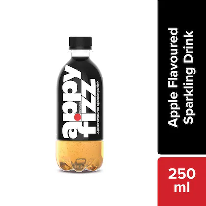
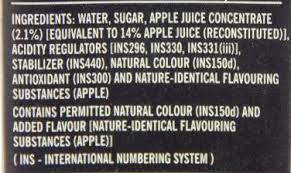
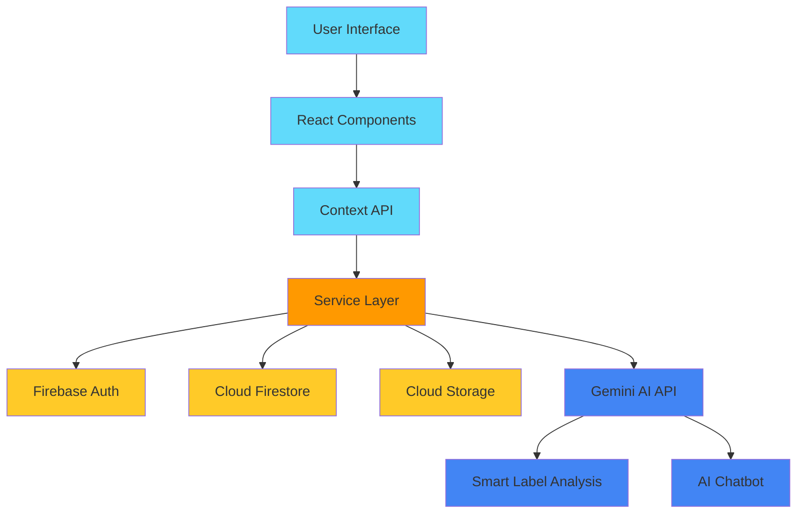
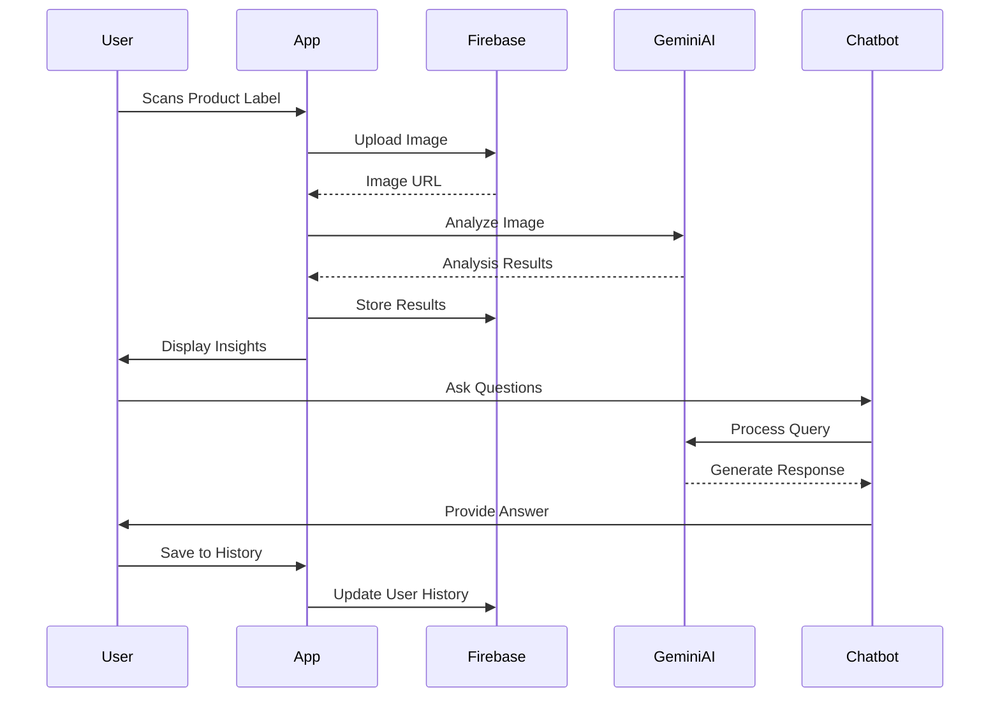

# 🔍 ScanTheLie

### AI-Powered Food Label Analysis

[📸 Try Demo](https://scanthelie.vercel.app) • [📚 Documentation](./docs/SIMPLE_DOCS.md) • [🤝 Contributing](./CONTRIBUTING.md) • [📝 Report Bug](https://github.com/muhammedashharps/scanthelie/issues)

### 📸 Try with these example images:

*For best results, ensure your product label images are clear and well-lit like these examples*

## 🎯 Real-World Problem & Solution

In today's world of processed foods and marketing claims, consumers often struggle to make informed decisions about their food choices. **ScanTheLie** empowers users to:

- 📸 Scan food product labels
- 🔍 Verify marketing claims
- 🧪 Analyze ingredients
- 📊 Get personalized health insights
- 📱 Track consumption patterns
- 🤖 Get real-time AI assistance

### Real-Life Example

> Sarah, a mother of two with a family history of diabetes, wants to ensure she's making the best food choices. While shopping, she encounters a product labeled "Sugar-Free" but contains unfamiliar ingredients. Using ScanTheLie, she:
> 1. Scans the product label
> 2. Gets instant verification of the "Sugar-Free" claim
> 3. Receives a detailed breakdown of alternative sweeteners used
> 4. Views a personalized health impact assessment
> 5. Chats with the AI assistant to understand complex ingredients
> 6. Saves the product to her history for future reference

## 🏗️ Technical Architecture

## 🔄 Application Workflow

## 🛠️ Tech Stack

- **Frontend Framework**: React with TypeScript
- **Styling**: TailwindCSS + Framer Motion
- **Backend**: Firebase
- **AI Integration**: Gemini AI

## 🤖 AI Assistant Features

The integrated AI chatbot in the websiteserves as your personal product expert:

- **Instant Answers**: Get immediate responses about ingredients, nutrition, and health claims
- **Context-Aware**: The chatbot understands the scanned product's context for accurate answers
- **Health Insights**: Receive detailed explanations about health implications
- **Ingredient Analysis**: Understand complex ingredient names and their purposes
- **Safety Alerts**: Get warnings about potential allergens or harmful ingredients
- **Smart Recommendations**: Receive personalized suggestions based on your health profile

The AI assistant is powered by Google's Gemini AI, providing:
- Natural language understanding
- Real-time response generation
- Product-specific knowledge
- Health and safety awareness
- Personalized interactions

## 📱 Other Features

- **Smart Label Scanning**
  - OCR-powered text extraction
  - Ingredient analysis
  - Claim verification

- **Personalized Insights**
  - Health score calculation
  - Dietary recommendations
  - Allergen alerts

- **User Dashboard**
  - Scan history
  - Favorite products
  - Consumption patterns
  - Health trends

- **AI-Powered Analysis**
  - Marketing claim verification
  - Ingredient safety assessment
  - Nutritional value analysis

---

Made with ❤️ for healthier food choices
 
