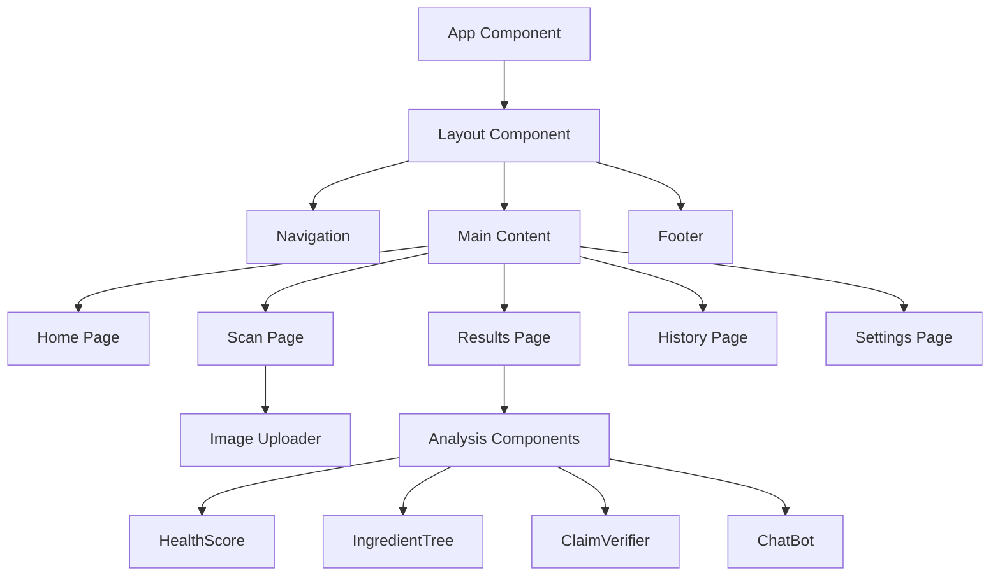
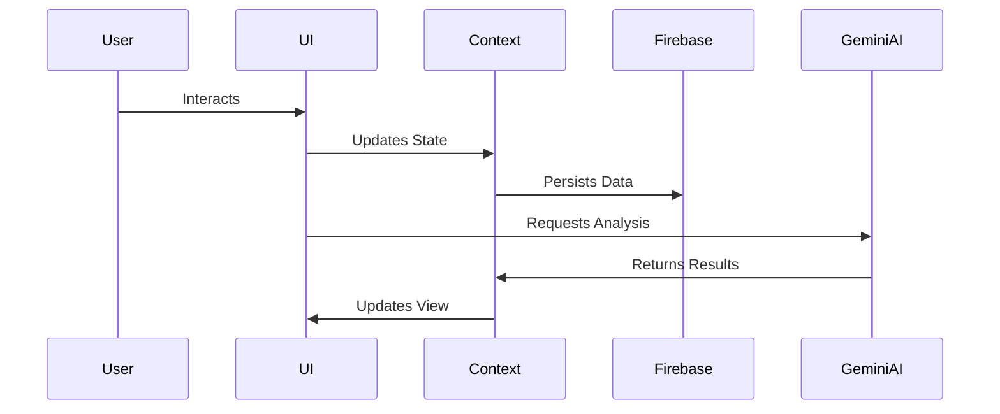

# Technical Architecture

## Overview

ScanTheLie is built using a modern web stack with React and Firebase, incorporating AI capabilities through Google's Gemini AI. The application follows a component-based architecture with clear separation of concerns.

## Tech Stack

### Frontend
- **React 18.3.1**: Core UI framework
- **TypeScript 5.5.0**: Type safety and developer experience
- **Vite 5.4.2**: Build tool and development server
- **TailwindCSS 3.4.1**: Utility-first CSS framework
- **Framer Motion**: Animation library
- **React Router DOM**: Client-side routing
- **Recharts**: Data visualization

### Backend Services
- **Firebase**: Backend-as-a-Service
  - Authentication
  - Cloud Firestore
  - Cloud Storage
- **Gemini AI**: AI/ML capabilities

## Component Architecture

## State Management

### Context API
- **AuthContext**: Manages authentication state
- **AppContext**: Manages application-wide state
  - API key management
  - Scan history
  - User preferences
  - Loading states

## Data Flow

## Security

1. **Authentication**
   - Google Sign-in
   - Protected routes
   - Session management

2. **Data Protection**
   - Environment variables
   - Firebase security rules
   - API key protection

## AI Integration

### Gemini AI Features
1. Label Analysis
   - Text extraction
   - Ingredient analysis
   - Claim verification

2. Interactive Chatbot
   - Context-aware responses
   - Product-specific knowledge
   - Health insights

## Performance Optimization

1. **Code Splitting**
   - Route-based splitting
   - Component lazy loading

2. **Asset Optimization**
   - Image compression
   - Lazy loading
   - CDN delivery

3. **State Management**
   - Memoization
   - Efficient context usage
   - Optimized re-renders 