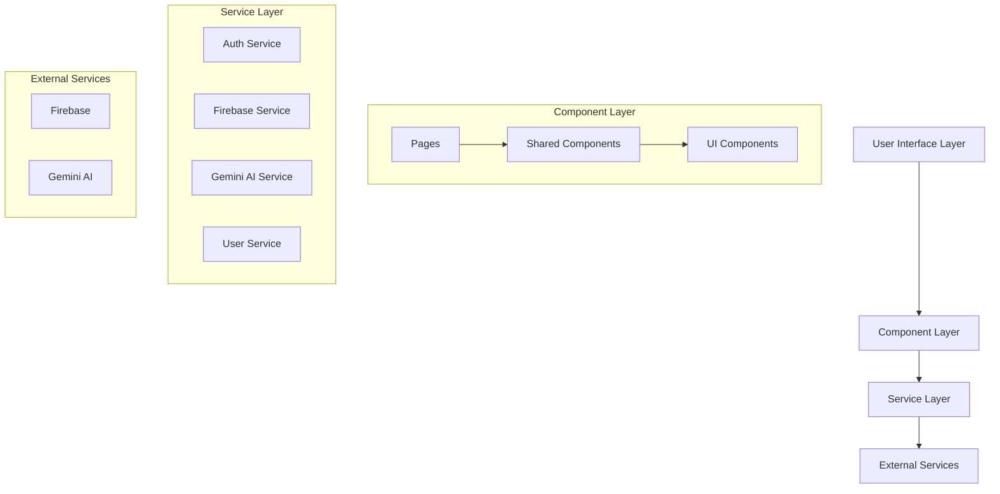
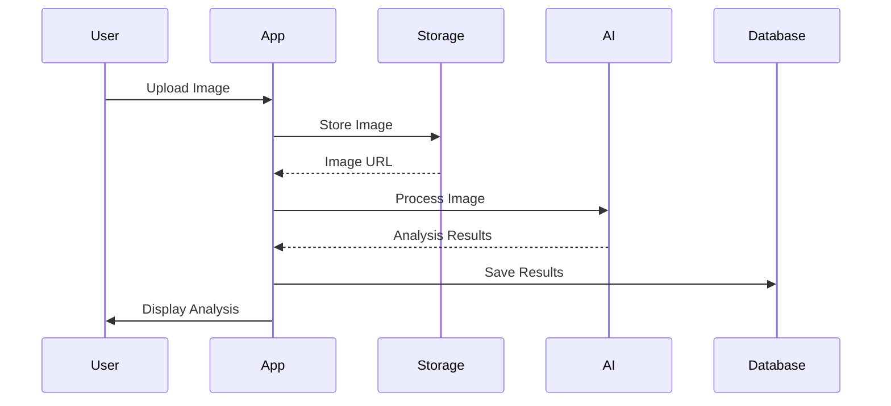
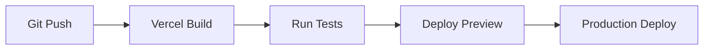

# ScanTheLie - Technical Documentation

## Project Overview

ScanTheLie is an AI-powered web application that helps users make informed decisions about food products by analyzing product labels, verifying claims, and providing personalized health insights.

## System Architecture

### Frontend Architecture


## Core Technologies

### Frontend Stack
- **React (v18.3.1)**: Core UI framework
- **TypeScript (v5.5.0)**: Static typing and enhanced developer experience
- **Vite (v5.4.2)**: Build tool and development server
- **TailwindCSS (v3.4.1)**: Utility-first CSS framework

### Backend Services
- **Firebase**
  - Authentication: User management and Google Sign-in
  - Firestore: NoSQL database for user data and scan history
  - Storage: Image storage for product labels
- **Gemini AI**: AI/ML capabilities for image analysis and chatbot

## Key Components

### 1. Authentication System
- Implements Google OAuth 2.0
- Protected routes using React Router
- Persistent session management

### 2. Scan Processing Pipeline


### 3. AI Integration

#### Image Analysis
- OCR for text extraction
- Ingredient identification
- Claim verification
- Health score calculation

#### Chatbot System
- Context-aware responses
- Product-specific knowledge base
- Real-time interaction
- Health insights generation

### 4. Data Models

#### User Profile
```typescript
interface UserProfile {
    uid: string;
    preferences: UserPreferences;
    scanHistory: ProductScan[];
}
```

#### Product Scan
```typescript
interface ProductScan {
    id: string;
    timestamp: Date;
    imageUrls: string[];
    result: ScanResult;
    status: 'pending' | 'completed' | 'failed';
}
```

## Security Implementation

### 1. Authentication Security
- JWT token-based authentication
- Protected route middleware
- Session management

### 2. Data Security
- Firebase Security Rules
- Environment variable protection
- API key management

### 3. Frontend Security
- Input sanitization
- XSS protection
- CORS configuration

## Performance Optimizations

### 1. Image Processing
- Client-side image compression
- Lazy loading
- Progressive image loading

### 2. Application Performance
- Code splitting
- Route-based chunking
- Asset optimization
- Memoization of expensive computations

### 3. State Management
- Context API optimization
- Selective re-rendering
- State normalization

## Error Handling

### 1. Global Error Boundaries
- React error boundaries for component errors
- Global error handler for uncaught exceptions
- User-friendly error messages

### 2. Service-Level Error Handling
- API error handling
- Network error recovery
- Retry mechanisms

## Testing Strategy

### 1. Unit Testing
- Component testing with React Testing Library
- Service layer unit tests
- Utility function testing

### 2. Integration Testing
- API integration tests
- Authentication flow testing
- End-to-end user flows

## Deployment Architecture

### Production Environment
- Vercel hosting
- Automatic HTTPS
- Global CDN distribution
- Environment-specific configurations

### CI/CD Pipeline


## Monitoring and Analytics

### 1. Performance Monitoring
- Vercel Analytics
- Firebase Performance Monitoring
- Error tracking

### 2. User Analytics
- User engagement metrics
- Feature usage tracking
- Error reporting

## Future Scalability Considerations

### 1. Technical Scalability
- Microservices architecture potential
- Database sharding capability
- Caching implementation

### 2. Feature Scalability
- API versioning support
- Plugin architecture
- Multi-language support structure

## API Documentation

### 1. Firebase API
- Authentication endpoints
- Data storage operations
- File storage operations

### 2. Gemini AI API
- Image analysis endpoints
- Chatbot interaction
- Health analysis algorithms

## Environment Setup

### Development Environment
```bash
# Install dependencies
npm install

# Start development server
npm run dev

# Build for production
npm run build
```

### Environment Variables
```env
VITE_FIREBASE_API_KEY=
VITE_FIREBASE_AUTH_DOMAIN=
VITE_FIREBASE_PROJECT_ID=
VITE_FIREBASE_STORAGE_BUCKET=
VITE_FIREBASE_MESSAGING_SENDER_ID=
VITE_FIREBASE_APP_ID=
```

## Contributing Guidelines

1. Fork the repository
2. Create feature branch
3. Follow coding standards
4. Write tests
5. Submit pull request

## Support and Resources

- GitHub Repository: [scanthelie](https://github.com/muhammedashharps/scanthelie)
- Deployment: [scanthelie.vercel.app](https://scanthelie.vercel.app)
- Firebase Console: [console.firebase.google.com](https://console.firebase.google.com)
- Gemini AI Documentation: [Google Cloud](https://cloud.google.com) 